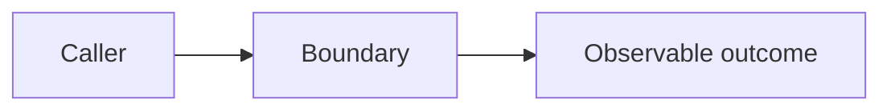

# {{title}}

{{coreClaim}}

## Boundary to draw

Describe the public-safe boundary that a diagram should clarify.

## Diagram

Use an abstract diagram with generic labels. Do not copy a real deployment,
account boundary, hostname, queue name, repository name, or private data flow.

## Supporting points

Use only these seed-approved points:

{{allowedMaterial}}

## Operational consequence

Explain which ownership, testing, observability, or delivery decision becomes
easier once the boundary is explicit.
